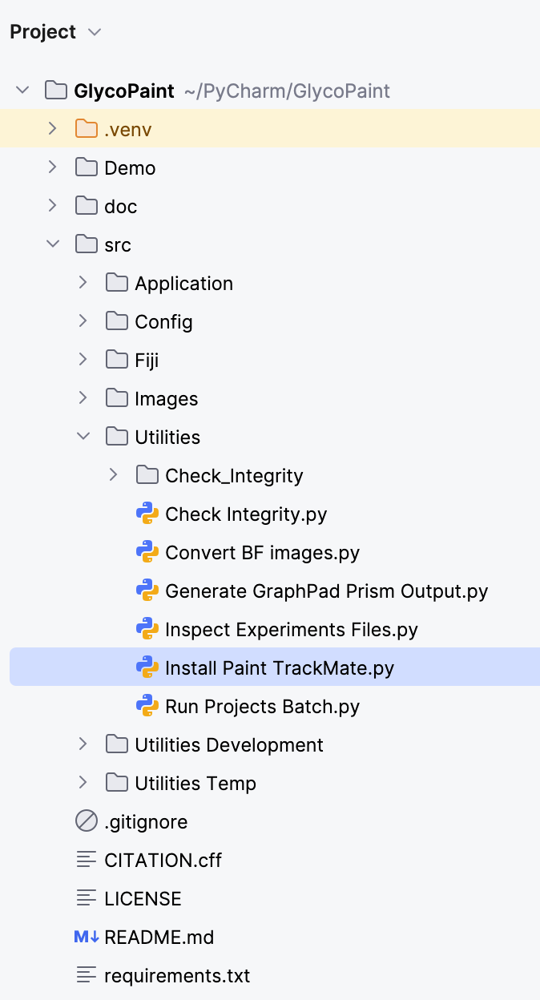
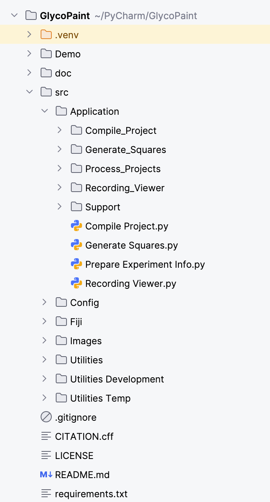

# Installing the Pipeline

The GlycoPaint pipeline is a research application and not developed for a large audience. Consequently, installing and running it requires some support.

### Fiji and TrackMate
The pipeline depends heavily on Fiji and TrackMate. To install Fiji refer to the following website: [https://imagej.net/software/fiji/](https://imagej.net/software/fiji/).
The trackmate plugin comes preconfigured with the Fiji installation and is available for running under Plugins -> Tracking -> TrackMate.

Detailed knowledge of Fiji and TrackMate is not required to run the pipeline, but it is recommended to familiarize yourself with the software. Excellent sourced are available at https://imagej.net/learn/fiji/ and https://imagej.net/plugins/trackmate/. 

For a detailed description of TrackMate, see the following reference:

> Ershov, D., Phan, M.-S., Pylvänäinen, J. W., Rigaud, S. U., Le Blanc, L., Charles-Orszag, A., … Tinevez, J.-Y. (2022).
TrackMate 7: integrating state-of-the-art segmentation algorithms into tracking pipelines. Nature Methods, 19(7),
829–832. doi:10.1038/s41592-022-01507-1

### Python
The Python scripts were developed in PyCharm, and you can use Pycharm to run them, but any Python IDE should work. A free community version from PyCharm can be downloaded from [https://www.jetbrains.com/pycharm/](https://www.jetbrains.com/pycharm/).

The Python scripts are available from the GitHub repository [https://github.com/Leiden-chemical-immunology/GlycoPaint.git](https://github.com/Leiden-chemical-immunology/GlycoPaint.git). Easiest is to clone the repository to your local machine from PyCharm. To do that, you select 'Project from version control' and enter the repository URL https://github.com/Leiden-chemical-immunology/GlycoPaint.git. A local directory will be created and the code copied. 

You will have to set up a Pyhon interpreter in PyCharm and install the following libraries (the version numbers are not critical, but just indicate the versions used during development):

- matplotlib (3.9.2)
- numpy (2.1.2)
- pandas (2.2.3)
- pillow (10.4.0)
- scipy (1.14.)
- nd2reader (3.3.0)

The resulting environment, displayed below, should be able to run the pipeline.

### Installing the Trackmate plugin

Fiji has been installed in an earlier step, and per default the TrackMate plugin is available. The GlycoPaint plugin however, needs to be installed separately. This is done by copying a selection of files to the Fiji/Scripts/GlycoPaint directory. In the Python code hierarchy, in the 'src/Utilities Application' directory, there is a utility that does that: 'Install Paint TrackMate.py'. 

Running the utility will create the paint.json file in the ~/Paint/Defaults directory if it does not already exist. The utility will then try to establish the path of the Fiji app and copy the necessary files to the plugin directory. If the Fiji path cannot be found, the user can manually supply the correct path in the paint.json file. Rerunning the utility would then cause the files to be copied in the second attempt.  

### R Studio
The pipeline also uses R for the data analysis. R Studio can be downloaded from [https://rstudio.com/products/rstudio/download/](https://rstudio.com/products/rstudio/download/). You may have to install R also - instructions to do that are on the site. Examples of R scripts are available from the GitHub repository

### Install Time
With standard software as PyCharm, Fiji and TrackMate installed, the installation of the pipeline itself should take less than 10 minutes. Installing the standard R and R Studio is optional and only required if data post processing is performed with R.

# Available scripts to run the pipeline

With Pycharm installed, the environment set up, and the code cloned from the repository, you are ready to run the pipeline. There is a collection of scripts and support files, but for just tunning thr piepline a smnall number if scripts are needed. They are found in the src directory under Applications

